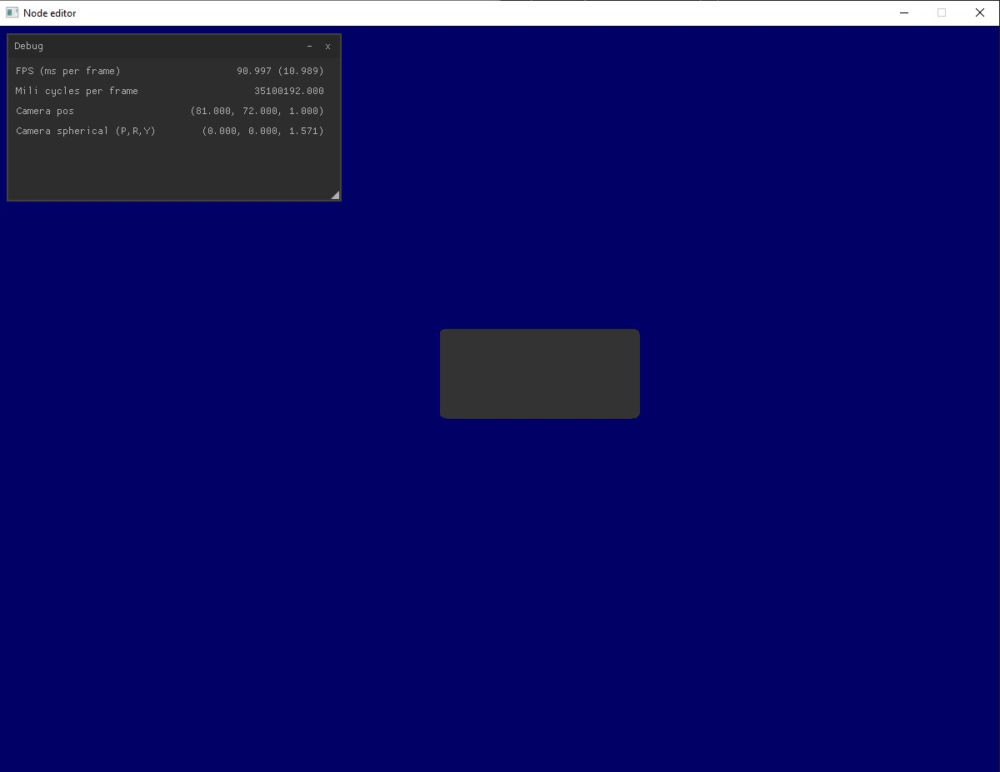

# Raw Node editor

Node editor UX exploration. By *raw* I mean that it is basically an OpenGL app written from scratch. Nuklear GUI lib is used for statistics, debug, etc.

## Current state

21-07-2019 - The code from main.cpp needs to be migrated into node_editor.cpp.

## Dependencies

- SDL2
- glew
- cglm
- dirent_win

## Init project

### GLEW

Go into `auto` folder and do `make`. After that solution from `glew\build\vc15`
should build fine.
